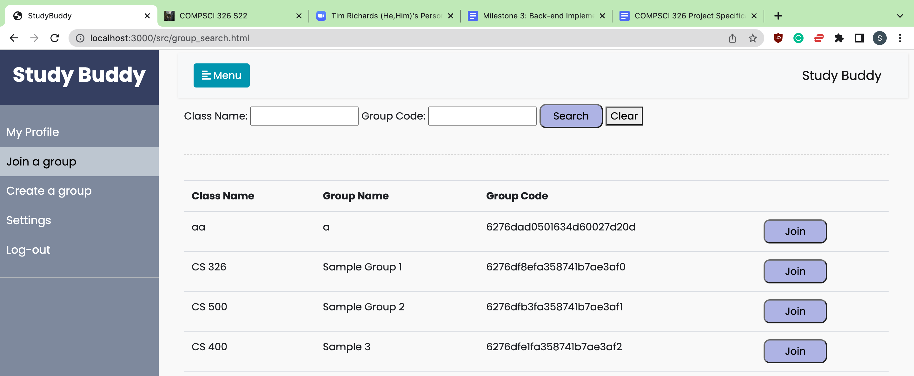
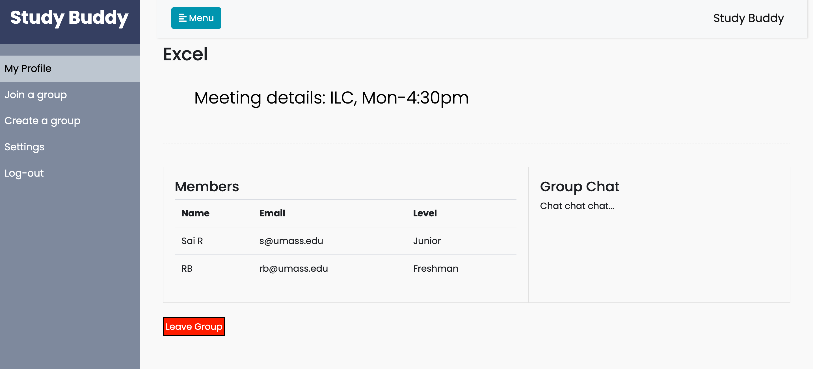

# AD-Blockers #

## Study Group ##
### Spring: 2022 ###

### Application Website ###
https://cs-326-studdybuddy.herokuapp.com/src/

#### Overview ####
Our application is a platform for students to find study groups for any of their classes. It allows students to create and join study groups and be part of the discussion. We have started this application from one of the difficulties we faced as freshmen before making our own friend circle. Sometimes your friends do not take the same class as you and it is hard to find the right group to study with. We do have groups on other social media like discord, facebook but what makes us innovative is the ability to get all of them under the same hood so that students do not have to search more for getting any assistance. The application has a very one click register method and you can start joining/creating a required study group. With its easy to use interface you can create a group and specify when and where you plan to meet, if it’s virtual please feel free to drop in the zoom link.

The application also lets you leave and join at your own convenience making the roster of your study groups different each semester. This is an attempt to make more collaborative learning sessions and give students additional resources.


#### Team Members ####
1. Anurag Gumidelli (Anurag-Gumidelli)
2. Sai Rohan Bangari (sbangariGIT)
3. Adithya Kethu (akethu)

#### User Interface ####

1. Landing Page

<br>This page is the first page that the user sees. Here we have the list of all the study groups and you have opition to navigate to login and sign up. This uses the get command to fetch all the groups 


2. Login Page

<br>This is where you can login using email and password, if the email does not exist you will get a message saying create an account otherwise, or if the password is incorrect the message would be incorrect password. We store the authentication creditials in our database.


3. Sign Up Page

<br>This is where you can Sign using email and password and other information. You will be redirected to the create page.


4. Profile Page

<br>This is the profile page where the current users details are in here. We have all the groups a user is part of, his notifications and information. We can dismiss the notifications which triggers delete in our database


5. Create Group Page

<br>This is where you can create a group. This will make a group in our database.


6. Join Group Page

<br>This is where you can join a group from. This will trigger notification to the user indicating that you joined the group. The groups which you are already part of would not be displayed in this list



7. Edit Profile Page

<br>This the page where you can update users information. This page calls functions to update the database.


8. Group Page

<br>This the page for each individual group page. This page loads all the details of a group and lets you leave the group.



#### API's ####
Here is the list of the API's we use

| Type of CRUD | Name of the API | Functionality                                                                                   |
|--------------|-----------------|-------------------------------------------------------------------------------------------------|
| CREATE       | /register       | This takes in all the required information for registering and adds<br>the user to the database |
| CREATE       | /createGroup    | This takes in all the group information and creates and new group for<br>a particular class     |
| READ         | /myGroups       | This API returns the list of groups of a particular user which they <br>are part of.            |
| READ         | /getAllGroups   | This API returns the list of all groups present in our system                                   |
| READ         | /getmyNotis     | This API return all the current notifications a user has.                                       |
| UPDATE       | /updateProfile  | This API updates the in information of a user.                                                  |
| DELETE       | /deleteNoti     | This function removes the notification after the user deletes it.                               |
| DELETE       | /exitGroup      | This API function removes a user from a certain group given its id.                             |

A detailed utilization of the above are described in URL rounting and mapping.

#### Database ####
We used noSQL database: MongoDB atlas. Here we have two major collections <b>Users</b> and <b>Groups</b>.

1. Users
<br>every document contains the following attributes
<br>_id: Unique Identifier id (Type: Object)
<br>email:  email of a user (Type: String)
<br>password: password of the user (Type: String)
<br>name: name of the user (Type: String)
<br>major: major of the user (Type: String)
<br>cred_level: Freshman | Junior | Senior etc (Type: String)
<br>profile_url: url of the image (Type: String)
<br>notifications: array of notification (Type: Array)

1. Groups
<br>every document contains the following attributes
<br>_id: Unique Identifier id (Type: Object)
<br>class: which class does the group belong (ex: CS 326) (Type: String)
<br>name: name of the group (Type: String)
<br>loc_and_time: location and time of meeting (Type: String)
<br>type: Public | Private
<br>size: max capacity (Type: Number)
<br>members: array of notification (Type: Array)


#### URL Routes/Mappings ####
1. **GET /myGroups**
   Takes in userId which then gets the list of all the groups of a particular user.

    **Example Request**:

      [http://localhost:3000/myGroups/?email=${'email'](http://localhost:3000/myGroups?email=$'email')

    **Example Request Body**:
      ```json
      { "email": "wcalcott0@soup.io" }
      ```

    **Example Response** (200 OK status code):

      ```json
      [{
    "group_id": "0913",
    "_class": "CS-58",
    "name": "Transcof",
    "members": [
      {
        "id": 1,
        "email": "rcolvine8@liveinternet.ru",
        "name": "Y-find",
        "cred_level": "Freshmen"
      }
        ],
    "type": "public",
    "max": 10
     }, {
    "group_id": "7713",
    "_class": "OIM-16",
    "name": "Temp",
    "members": [
      {
        "id": 1,
        "email": "rcolvine8@liveinternet.ru",
        "name": "Y-find",
        "cred_level": "Freshmen"
      }
        ],
    "type": "public",
    "max": 10
    }]
      ```
2. **POST /createGroup**

      This endpoint will be used to create a new group given its details

      **Example Request**:

      [http://localhost:3000/createGroup](http://localhost:3000/createGroup)

      **Example Request Body**:

      ```json
        {
    "group_id": "5369",
    "_class": "CS-43",
    "name": "Asoka",
    "members": [
      {
        "id": 9,
        "email": "rcolvine8@liveinternet.ru",
        "name": "Y-find",
        "cred_level": "Freshmen"
      }
    ],
    "type": "public",
    "max": 10
      }
      ```

      **Example Response** (200 OK status code):

      ```json
      {
        "status": "success"
      }
      ```

3. **GET /myNotis**
   Takes in userId which then gets the list of all the notifications of a particular user.

    **Example Request**:

      [http://localhost:3000/myNotis?email=${email)](http://localhost:3000/myNotis?email=${email))


    **Example Response** (200 OK status code):

      ```json
      [{
            "message": "Wants to join the group",
            "sent_by_id": 1,
            "group_name": "Trippledex"
        }]
      ```
4. **POST /createNoti**

      This endpoint create notifications mentioned in noti field to all the users in the send_to button.

      **Example Request**:

      [http://localhost:3000/createNoti](http://localhost:3000/createNoti)

      **Example Request Body**:

      ```json
        {
     "noti": {
            "message": "Wants to join the group",
            "sent_by_id": 3,
            "group_name": "Trippledex"
        },
    "send_to": [{"id": 1, "id": 2}]
      }
      ```

      **Example Response** (200 OK status code):

      ```json
      {
        "status": "success"
      }
      ```

5. **POST /regesiter**

      This endpoint creates a new user into our backend

      **Example Request**:

      [http://localhost:3000/regesiter](http://localhost:3000/regesiter)

      **Example Request Body**:

      ```json
        {
        "id": 1,
        "email": "wcalcott0@soup.io",
        "name": "Zontrax",
        "password": "password",
        "major": "Human Resources",
        "cred_level": "Freshmen",
        "profile_url": "https://robohash.org/voluptatemreprehenderitexcepturi.png?size=50x50&set=set1"
      }
      ```

      **Example Response** (200 OK status code):

      ```json
      {
        "status": "success"
      }
      ```
6. **PUT /addToGroup**

      This endpoint adds the user to the members array in our groups.json

      **Example Request**:

      [http://localhost:3000/addToGroup](http://localhost:3000/addToGroup)

      **Example Request Body**:

      ```json
        {
        "id": 1,
        "email": "wcalcott0@soup.io",
        "name": "Zontrax",
        "cred_level": "Freshmen",
      }
      ```

      **Example Response** (200 OK status code):

      ```json
      {
        "status": "success"
      }
7. **GET /getAllGroup**

      This endpoint get the list of all groups

      **Example Request**:

      [http://localhost:3000/getAllGroup](http://localhost:3000/getAllGroup)


      **Example Response** (200 OK status code):

      ```json
      [{
    "_id": "2046",
    "class": "PHY-44",
    "name": "Sonsing",
    "members": [
      {
        "id": 4,
        "email": "atownson3@purevolume.com",
        "name": "Tempsoft",
        "cred_level": "Sophomore"
      },
      {
        "id": 9,
        "email": "rcolvine8@liveinternet.ru",
        "name": "Y-find",
        "cred_level": "Freshmen"
      }
    ],
    "type": "public",
    "max": 10
        }, {
    "_id": "2813",
    "class": "MATH-07",
    "name": "Gembucket",
    "members": [
      {
        "id": 1,
        "email": "wcalcott0@soup.io",
        "name": "Zontrax",
        "cred_level": "Freshmen"
      },
      {
        "id": 2,
        "email": "zruncieman1@live.com",
        "name": "Bytecard",
        "cred_level": "Junior"
      }
    ],
    "type": "public",
    "max": 10
        }]

8. **PUT /login**

      This endpoint is for login

      **Example Request**:

      [http://localhost:3000//login?email=${email_value}&password=${password}](http://localhost:3000//login?email=${email_value}&password=${password})

      **Example Request Body**:

      ```json
        {
        "email": "wcalcott0@soup.io",
        "password": "sample pass"
      }
      ```


      **Example Response** (200 OK status code):

       ```json
      {
        "status": "success",
      "id": 10,
      "email": "sample@gmail.com",
      "major": "major']",
      "cred_level": "cred_level",
      "profile_url": "profile_url"
      }
       ```json
      {
        "status": "no user"
      }

9. **DELETE /deletenoti**

      This dismisses and deletes the notification of a user given the user Id.

      **Example Request**:

      [http://localhost:3000//deleteNoti?email=${email}&id=${id}](/deleteNoti?email=${email}&id=${id})

      **Example Response** (200 OK status code):

      ```json
      {
        "status": "success"
      }
      
#### Authentication/Authorization ####

Login Authenitcation:
We are storing the username and password in the database and using that to handle the authentication.

Inside the application:
While we make sure that you connot see any infromation apart from group names, the functionilty of going into a single group page only opens up if a particular user is part of the group.
Hence teven if you copy past a browser url from one browser to another we check if the group id exists for that user before giving him access to the group information. This is the only authorization part of our application. Given that public groups are open one gets admitted into the group as soon as you click join.

#### Division of Labor ####
1. Anurag Gumidelli (Anurag-Gumidelli):
<br>Milestone 1
<br>1. Collaborated in the design of the backend by making the schemas for the documents and collection.
<br>2. Made the prototype images in the Figma for some of the pages to make the wireframes.
<br>3. Created create_group.html, edit_profile.html and edited profile.html.
<br>Milestone 2
<br>1. Added express routes and morgan integration to the server.js file
<br>2. Reviewed and fixed search functionality in group_search.js and landing.js
<br>3. Edited UI view of profile.html and edit_profile.html
<br>4. Deployed Project on Heroku and edited all code to work on heroku, updated port and cleaned the fetch requests.
<br>5. Added create_group.js invite function to load and send invites to people added in the invite list.
<br>6. Added API calls for create_group.html and edit_profile.html
<br>Milestone 3
<br>1. Set up and hosted application on Heroku.
<br>2. Created methods from scratch to facilitate login auth for email.
<br>3. Implemented exit from group function and created database calls to update the group members.
<br>4. Implemented create group function and start a new group with the fetched details.
<br>5. Peer programmed and code reviewed to find and debug notification and login functions.
<br>6. Cleaned the code base and sanity checked all functions and API calls to make sure usage is not hindered.
<br>7. Updated database queries to facilitate faster responses.


2. Sai Rohan Bangari (sbangariGIT):
<br>Milestone 1
<br>1. Collaborated in the design of the backend by making the schemas for the documents and collection.
<br>2. Made the prototype images in the Figma for most of the pages to make the wireframes.
<br>3. Documented the teams progress in the md files
<br>Milestone 2
<br>1.Updated the index.html and group_search.html to have the UI elements render via js.
<br>2. Made fetch calls, express calls for getting list of all groups and display them in index.html and group_search.html.
<br>3. Made dummy data for groups and users so that we can use them to test our Apis.
<br>4. Wrote the markdown file for the project milestone-2.
<br>5. Wrote search algorithm to search for study groups based on code and class.
<br>6. Login Page and API for checking if the user already exists.
<br>7. Sign UP Page and API for POSTing a new user into the database.
<br>Milestone 3
<br>1. Worked on changing the login/SignUp from writing in JSON to mongoDB.
<br>2. Added authentication so that the username and password are stored and verified before the user enters the application.
<br>3. Edited the schema to better fit our needs for the user and Groups.
<br>4. Articulated the list of API's, UI, Overview and Overall experience. (Wrote the finals.md file which you are reading :) )
<br>5. Peer programmed with another teammate and worked on bug fixing of authentication and notifications.

3. Adithya Kethu (akethu):
<br>Milestone 1
<br>1. Set up the dashboard from scratch using HTML and Bootstrap.
<br>2. Built the code from scratch for the tables and columns inside the dashboard using bootstrap.
<br>3. Created multiple HTML pages for each wireframe created.
<br>4. Designed custom CSS for each page to match the design of the wireframe.
<br>Milestone 2
<br>1. Updated the profile.html and group_page.html to have the UI elements render via js.
<br>2. Made fetch calls, express calls for getting list of all groups/notifiications and display them in profile.html and group_page.html.
<br>3. Made dynamic JS components which render pages based on group info or user info.
<br>4. Set up local storage and modify the JSON file dynamically based on user or group info.
<br>5. Sends a notification and adds user to group based on user info dynamically.
<br>6. Filters/modifies JSON file based on flow of data.
<br>7. Deletes/adds users to groups.json file or notifications to users.json when a user joins a group (by using localStorage).
<br>Milestone 3
<br>1. Set up and integrated the MongoDB Atlas database.
<br>2. Created methods from scratch to fetch users and groups collections to process data.
<br>3. Modified methods to work with the database on updating notifications and groups particular to users.
<br>4. Implemented delete operations for updating notifications particular to users.
<br>5. Made the group_page.js to be dynamic — fetched dynamically from the database to update the same HTML page with different components based on which group the user wants to enter.
<br>6. Implemented ‘$set’ operations to update groups dynamically (particular to the user).

### Group Grading Rubric ###
We are writing the rubric for 100 points in total.
#### Design Phase: 30 Points ####
    1. Making the wireframes: 10 points
    2. Making the HTML & CSS based on the wireframes: 15 points
    3. Planning the Schema for our database: 5 points
#### Frontend Phase: 40 Points ####
    1.Being able to register and login: 10 points.
    2. Ability to create, search for groups: 10 points.
    3. Heroku deployment: 10 points.
    4. Data is consistant when you log out and log back in: 10 points.
#### Backend Phase: 30 points ####
    1. Converting from JSON to MongoDB: 15points.
    2. Notifications being pushed: 5 points.
    3. Ability to exit a group: 5 points.
    4. Change name and other information: 5 points

### Conclusion ###
The experience of building this application was unique in its own way. We had a good number of ups and downs, for some of the team members it was the first time building a full aplications while for some it was the first web application. We did fill a lot of knowledge gaps on how stuff works in the real world and going from an idea to an application. We did have a huge leraning curve in terms of making design choices and pivoting from one design to another to make the application better. Given more time we defenitly think we can add many more features and grow the application.

Design phase: we realized that this was the most important part of the project as we had to lay the foundation of what comes next. Suprisingly enough we realized that this part requires the least code but the most effort. We spend a good chuck of time on whiteboards rather than laptops to plan things out.

Front-End phase: In this phase we learned about prototyping software like figma and started making wireframes, all of the members were not art enthusiasts hence we had a good number of hours of doing work we did not enjoy. But by the end of it we did find some of our creative brain cells working. We did realise the frontend work is a significant job.

Back-End phase: This part was more of implementing what we already planned given that the structure of milestones went hand in hand with homeworks we just had to convert the backend and connect it to the databse. As we already wrote the structure of our collections and documents we had a smooth ride on this one. Couple of errors but stackoverflow and MongoDB documentation came to the rescue. 

To conclude we have a lot more to talk about web programming than what we had before starting the course, we learned a lot from each other and how to better work in a team environment. We acknowledge that this is just the tip of the ice berg in terms of what web programming is but are glad we could lay the foundation. Thank you all for making this happen!