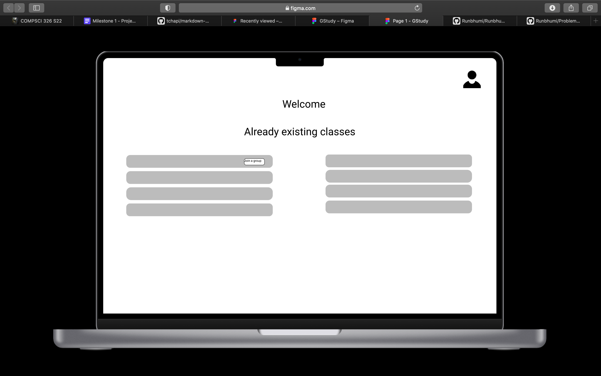
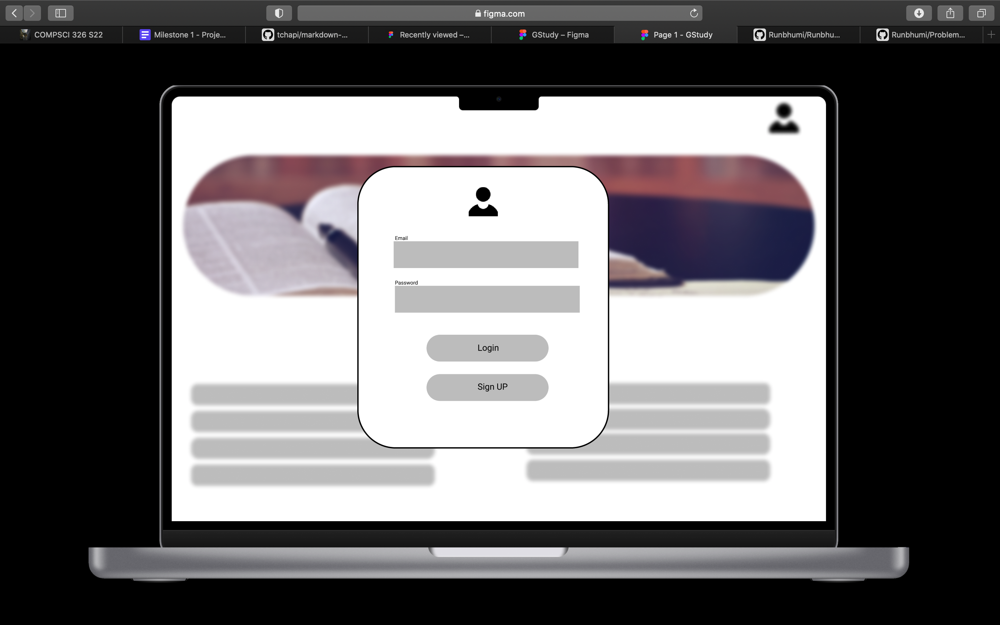
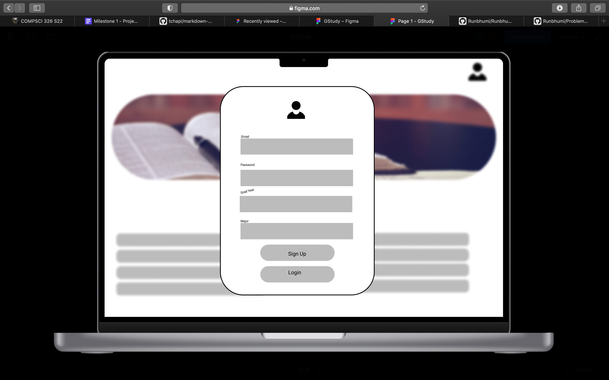
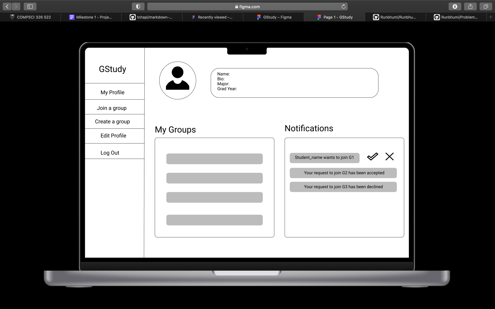
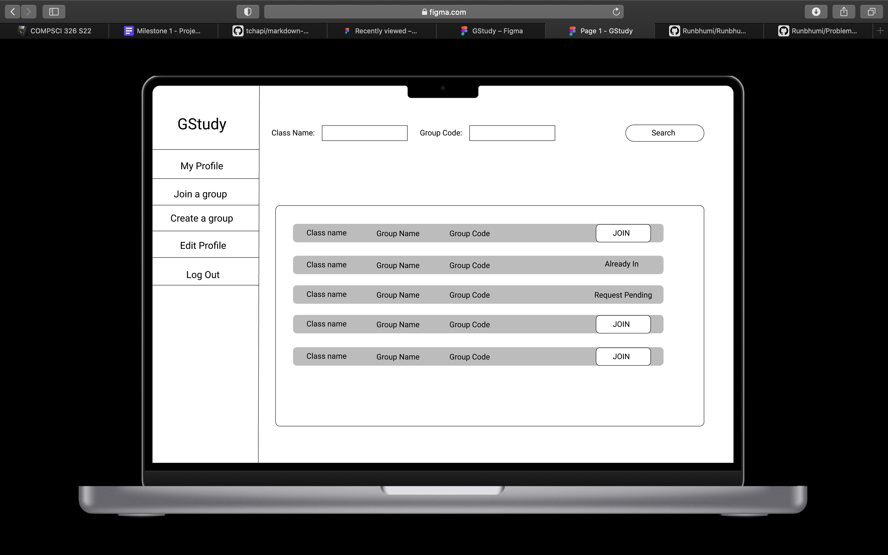
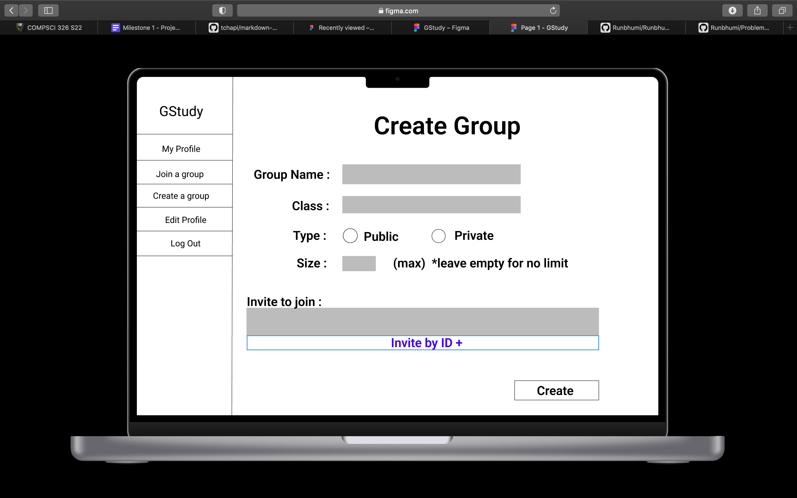

# Milestone 1

## Vision ##

Below given are our wireframes with the same order as a new user would observe, here we aim to make you understand what the flow would look like with description of each page.
Below attached is also our prototype in figma to give a feel for how the interactions feel. The html and CSS have the same structure with enhanced design elements.

### Landing Page ###
This is going to be our home screen, Here we will have the users the option to see the already existing study groups.
However in order to join any of these groups the user must first Login In

### Login Page ###
Here is where a user is going to login using his credentials 

### Sign Up Page ###
This is the page where user is going to sign up if he has not already.

### Profile Page ###
This is the profile infromation and all the groups whihc the user is part of. If the user is an admin of any study group he/she can manage new entries in the notifications.

### Search Study Group Page ###
This is the page where a user can search for a study group and then request to join it.

### Create Study Group Page ###
This is the page where you can create your own study group for students to join.

## Link to our prototype on figma ##

https://www.figma.com/proto/6kFqCFTPWjZhXkGsgjGR2y/GStudy?node-id=1%3A20&scaling=scale-down&page-id=0%3A1&starting-point-node-id=1%3A2

