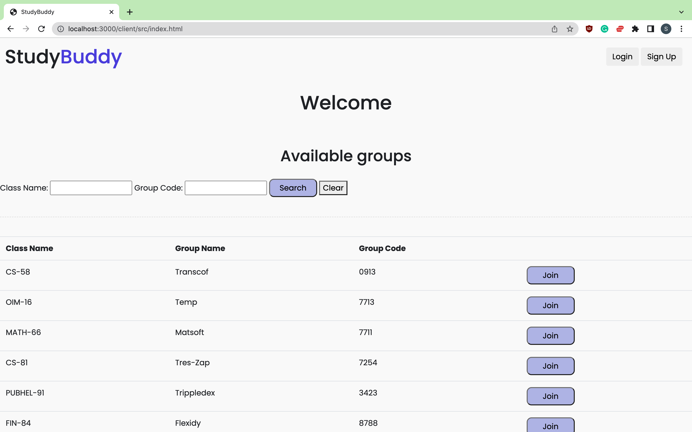
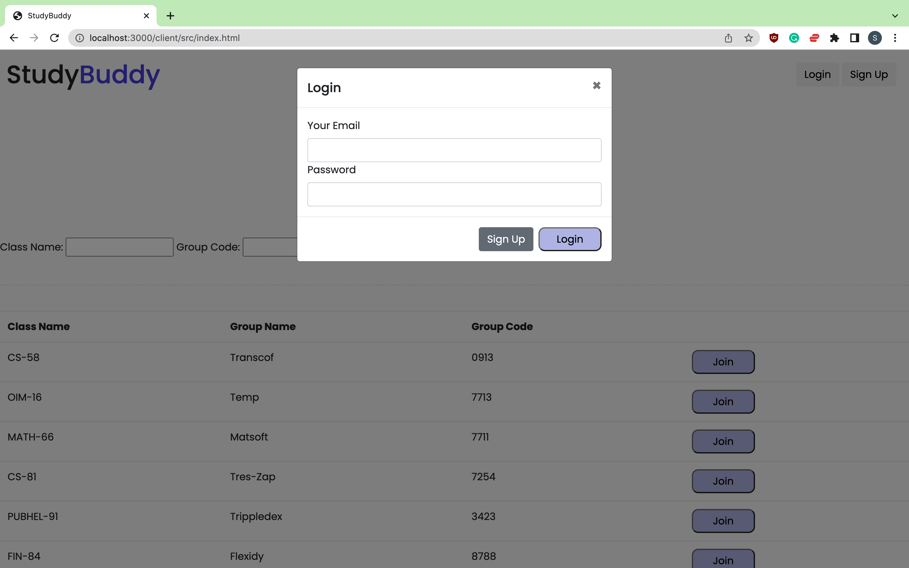
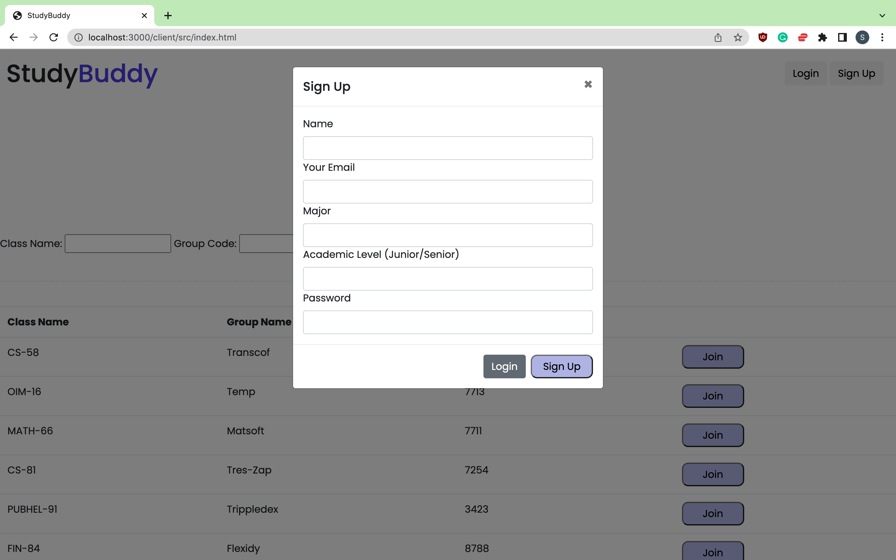
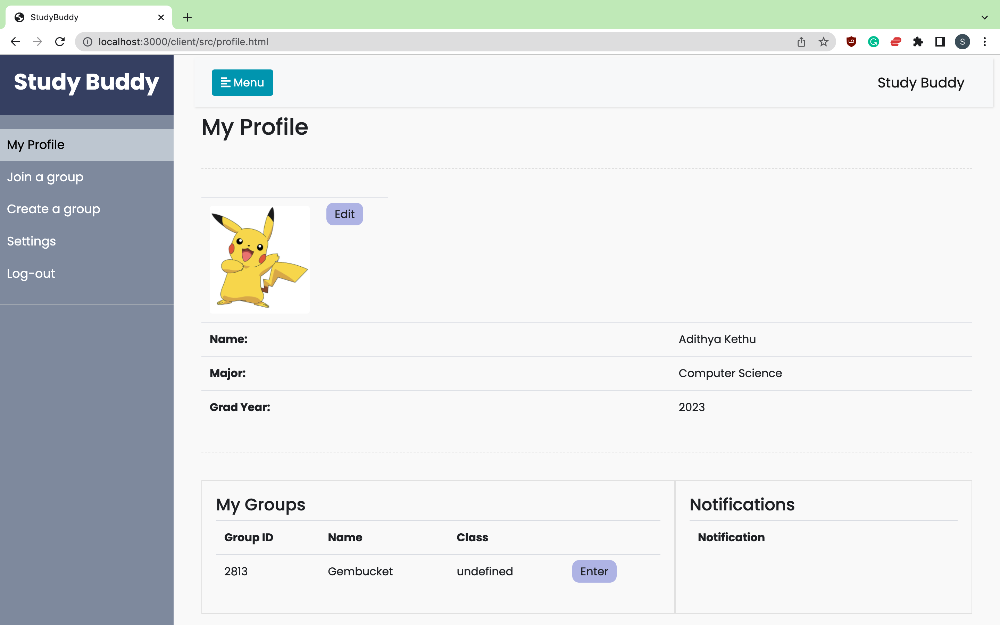
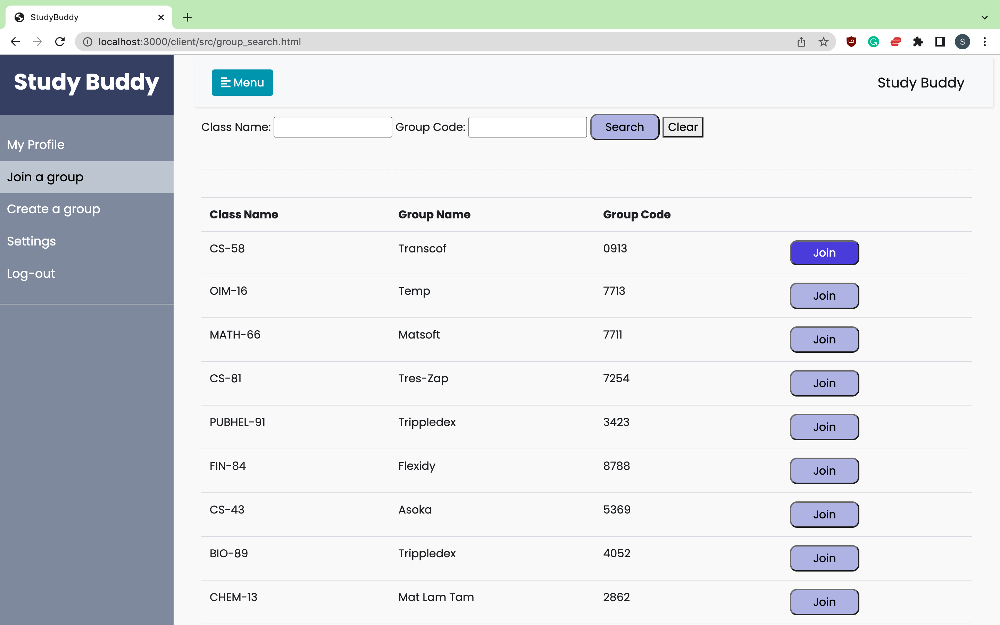

## API Breif ##

1. **GET /myGroups**
   Takes in userId which then gets the list of all the groups of a particular user.

    **Example Request**:

      [http://localhost:3000/myGroups/?email=${ls.getItem('email')](http://localhost:3000/myGroups?email=${ls.getItem('email'))

    **Example Request Body**:
      ```json
      { "email": "wcalcott0@soup.io" }
      ```

    **Example Response** (200 OK status code):

      ```json
      [{
    "group_id": "0913",
    "_class": "CS-58",
    "name": "Transcof",
    "members": [
      {
        "id": 1,
        "email": "rcolvine8@liveinternet.ru",
        "name": "Y-find",
        "cred_level": "Freshmen"
      }
    ],
    "type": "public",
    "max": 10
  }, {
    "group_id": "7713",
    "_class": "OIM-16",
    "name": "Temp",
    "members": [
      {
        "id": 1,
        "email": "rcolvine8@liveinternet.ru",
        "name": "Y-find",
        "cred_level": "Freshmen"
      }
    ],
    "type": "public",
    "max": 10
  }]
      ```
2. **POST /createGroup**

      This endpoint will be used to create a new group given its details

      **Example Request**:

      [http://localhost:3000/createGroup](http://localhost:3000/createGroup)

      **Example Request Body**:

      ```json
        {
    "group_id": "5369",
    "_class": "CS-43",
    "name": "Asoka",
    "members": [
      {
        "id": 9,
        "email": "rcolvine8@liveinternet.ru",
        "name": "Y-find",
        "cred_level": "Freshmen"
      }
    ],
    "type": "public",
    "max": 10
      }
      ```

      **Example Response** (200 OK status code):

      ```json
      {
        "status": "success"
      }
      ```

3. **GET /myNotis**
   Takes in userId which then gets the list of all the notifications of a particular user.

    **Example Request**:

      [http://localhost:3000/myNotis?email=${ls.getItem('email')](http://localhost:3000/myNotis?email=${ls.getItem('email'))


    **Example Response** (200 OK status code):

      ```json
      [{
            "message": "Wants to join the group",
            "sent_by_id": 1,
            "group_name": "Trippledex"
        }]
      ```
4. **POST /createNoti**

      This endpoint create notifications mentioned in noti field to all the users in the send_to button.

      **Example Request**:

      [http://localhost:3000/createNoti](http://localhost:3000/createNoti)

      **Example Request Body**:

      ```json
        {
     "noti": {
            "message": "Wants to join the group",
            "sent_by_id": 3,
            "group_name": "Trippledex"
        },
    "send_to": [{"id": 1, "id": 2}]
      }
      ```

      **Example Response** (200 OK status code):

      ```json
      {
        "status": "success"
      }
      ```

5. **POST /regesiter**

      This endpoint creates a new user into our backend

      **Example Request**:

      [http://localhost:3000/regesiter](http://localhost:3000/regesiter)

      **Example Request Body**:

      ```json
        {
        "id": 1,
        "email": "wcalcott0@soup.io",
        "name": "Zontrax",
        "major": "Human Resources",
        "cred_level": "Freshmen",
        "profile_url": "https://robohash.org/voluptatemreprehenderitexcepturi.png?size=50x50&set=set1"
      }
      ```

      **Example Response** (200 OK status code):

      ```json
      {
        "status": "success"
      }
      ```
6. **PUT /addToGroup**

      This endpoint adds the user to the members array in our groups.json

      **Example Request**:

      [http://localhost:3000/addToGroup](http://localhost:3000/addToGroup)

      **Example Request Body**:

      ```json
        {
        "id": 1,
        "email": "wcalcott0@soup.io",
        "name": "Zontrax",
        "cred_level": "Freshmen",
      }
      ```

      **Example Response** (200 OK status code):

      ```json
      {
        "status": "success"
      }
6. **GET /getAllGroup**

      This endpoint get the list of all groups

      **Example Request**:

      [http://localhost:3000/getAllGroup](http://localhost:3000/getAllGroup)


      **Example Response** (200 OK status code):

      ```json
      [{
    "group_id": "2046",
    "class": "PHY-44",
    "name": "Sonsing",
    "members": [
      {
        "id": 4,
        "email": "atownson3@purevolume.com",
        "name": "Tempsoft",
        "cred_level": "Sophomore"
      },
      {
        "id": 9,
        "email": "rcolvine8@liveinternet.ru",
        "name": "Y-find",
        "cred_level": "Freshmen"
      }
    ],
    "type": "public",
    "max": 10
  }, {
    "group_id": "2813",
    "class": "MATH-07",
    "name": "Gembucket",
    "members": [
      {
        "id": 1,
        "email": "wcalcott0@soup.io",
        "name": "Zontrax",
        "cred_level": "Freshmen"
      },
      {
        "id": 2,
        "email": "zruncieman1@live.com",
        "name": "Bytecard",
        "cred_level": "Junior"
      }
    ],
    "type": "public",
    "max": 10
  }]

7. **GET /login**

      This endpoint get the list of all groups

      **Example Request**:

      [http://localhost:3000/login?email=${sample@gmail.com}](http://localhost:3000/login?email=${sample@gmail.com)


      **Example Response** (200 OK status code):

       ```json
      {
        "status": "success",
      "id": 10,
      "email": "sample@gmail.com",
      "major": "major']",
      "cred_level": "cred_level",
      "profile_url": "profile_url"
      }

       ```json
      {
        "status": "no user"
      }


## Heroku URL ##


## Photo ##


Using get to get all the groups to display on the home screen




Using get login api to check if the user exists if they do they log into the application




Using post register to send in all the data and register a new user, then it takes you into the application



Using getNoti for getting coresponding notifications of the user. Get my groups from the user id and get all the groups from the chat. 




After joining a group sendNoti triggers Notification that you have joined a group

## Team Overview ##

1. Anurag Gumidelli (Anurag-Gumidelli):


2. Sai Rohan Bangari (sbangariGIT):
<br>1.Updated the index.html and group_search.html to have the UI elements render via js.
<br>2. Made fetch calls, express calls for getting list of all groups and display them in index.html and group_search.html.
<br>3. Made dummy data for groups and users so that we can use them to test our Apis.
<br>4. Wrote the markdown file for the project milestone-2.
<br>5.Wrote search algorithm to search for study groups based on code and class.
<br>6.Login Page and API for checking if the user already exists.
<br>7.Sign UP Page and API for POSTing a new user into the database.

3. Adithya Kethu (akethu):

